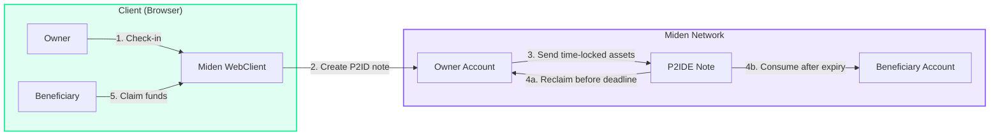

<p align="center">
  
  
  
  
  
  
</p>

# 🛡️ Dead Man's Switch — Miden Wallet

**Privacy-preserving crypto inheritance powered by Miden's zero-knowledge proof system.**

If you stop checking in, your assets automatically become claimable by your designated beneficiary. No intermediaries. No trust assumptions. No key sharing. Just cryptographic guarantees enforced by Miden's ZK-powered note system.

> **Live Frontend:** [Coming Soon — Vercel Deployment]
> **SDK:** [@miden-sdk/miden-sdk](https://www.npmjs.com/package/@miden-sdk/miden-sdk)
> **Docs:** [docs.miden.xyz/builder](https://docs.miden.xyz/builder)

---

## The Problem

Crypto inheritance is one of the biggest unsolved problems in Web3. Today:

| Problem | How It Happens | Impact |
|---------|---------------|--------|
| **Lost keys** | Owner dies or becomes incapacitated | $140B+ in Bitcoin alone is permanently lost |
| **Trust-based solutions** | Multisig with lawyers, custodians, or family | Single point of failure, centralization risk |
| **Shared keys** | Give someone your seed phrase "just in case" | Zero security — they can drain you anytime |
| **Smart contract timers** | Existing dead man's switch contracts on EVM | **All balances and beneficiaries are public** |
| **Custodial services** | Use Coinbase Vault, Casa, etc. | Counterparty risk, KYC, jurisdictional issues |

**Dead Man's Switch on Miden eliminates all of these.** Your switch is private, trustless, and enforced by zero-knowledge proofs. No one — not validators, not observers, not even the Miden network itself — can see your balance, your beneficiary, or when your switch triggers.

---

## Why Miden Is the Best Technology for This

Miden is uniquely suited for crypto inheritance because of four architectural properties that no other blockchain provides together:

### 1. 🔒 Privacy by Default
- Accounts and notes are private — the network only stores **cryptographic commitments** (hashes)
- Your vault balance, beneficiary address, and heartbeat interval are **invisible to the public chain**
- On Ethereum or Solana, every dead man's switch contract exposes: who the beneficiary is, how much is locked, and when the timer expires — making users a target

### 2. ⏰ Programmable Notes with Time-Lock (P2IDE)
- Miden's **P2ID (Pay-to-ID)** and **P2IDE (Pay-to-ID with Expiry)** notes are purpose-built for this pattern
- A P2IDE note says: *"This asset belongs to Account B, but only after Block X. Before that, Account A can reclaim it."*
- This is **exactly** what a dead man's switch needs — no custom smart contract logic required
- The time-lock is enforced at the protocol level, not by a contract that could be exploited

### 3. 🖥️ Client-Side Execution & Proving
- Transactions are executed and proven **locally on the user's device** using ZK proofs
- The network only verifies the proof — it never sees the transaction details
- This means your check-in activity pattern is **not visible** to chain observers
- No front-running, no MEV, no transaction ordering attacks

### 4. 🔗 Ethereum Security via Agglayer
- Miden settles on Ethereum with validity proofs via the **Agglayer**
- Your inheritance switch has the security guarantees of Ethereum L1
- But with the privacy and programmability of Miden's ZK architecture

### Comparison with Alternatives

| Feature | Miden DMS | EVM DMS | Multisig | Custodial |
|---------|-----------|---------|----------|-----------|
| **Private balances** | ✅ ZK-hidden | ❌ Public | ❌ Public | ⚠️ Company sees all |
| **Private beneficiary** | ✅ ZK-hidden | ❌ Public | ❌ Public | ⚠️ Company sees all |
| **No key sharing** | ✅ | ❌ Must share | ❌ Must share | ❌ Keys with custodian |
| **Trustless** | ✅ Math-enforced | ✅ Contract-enforced | ⚠️ Trust co-signers | ❌ Trust company |
| **Time-locked transfers** | ✅ Native P2IDE | ⚠️ Custom contract | ❌ Manual | ❌ Manual |
| **MEV resistant** | ✅ Client-side | ❌ Mempool visible | ❌ | N/A |
| **Censorship resistant** | ✅ | ⚠️ Depends on chain | ⚠️ | ❌ |
| **Ethereum security** | ✅ Via Agglayer | ✅ Native | ✅ | ❌ |

---

## Features

### Heartbeat Check-In System
- **Periodic proof-of-life** — owner checks in weekly, monthly, or yearly via a simple button press
- **Configurable intervals** — toggle between Weekly (7 days), Monthly (30 days), or Yearly (365 days)
- **On-chain timer** — heartbeat is recorded as a P2ID note sent to the beneficiary with a reclaim window

### Privacy-First Inheritance
- **Zero-knowledge vault** — balance and assets are never exposed on-chain
- **Hidden beneficiary** — no one can see who will inherit your funds
- **Silent check-ins** — activity patterns invisible to chain observers

### Dual-Mode Operation
- **Demo mode** — simulated blockchain with fake block progression for testing
- **Connected mode** — real Miden SDK operations with P2ID notes on testnet
- **Seamless switching** — same UI, same flows, just toggle the connection

### Beautiful, Responsive UI
- **Glassmorphism design** — dark theme with cyan/emerald accents
- **Animated countdown ring** — real-time visualization of time remaining
- **Mobile responsive** — full sidebar collapse, touch-friendly interactions
- **Toast notifications** — contextual feedback for every action

---

## Architecture



### Data Flow

```
Owner checks in (clicks "Check In" button)
    │
    ▼
WebClient creates P2ID note: Owner → Beneficiary
    │  (with time-lock = heartbeat interval)
    │
    ▼
Note sent to Miden network (ZK proof submitted)
    │  (network sees proof, not details)
    │
    ▼
Timer starts counting down (blocks)
    │
    ├── Owner checks in again → Old note reclaimed, new note created
    │
    └── Owner stops checking in → Note expires
            │
            ▼
        Beneficiary consumes expired P2IDE note
            │
            ▼
        Assets transferred to beneficiary account
```

---

## Privacy Guarantees

| Data | While Active | After Switch Triggers |
|------|-------------|----------------------|
| Your vault balance | 🔒 ZK-hidden | 🔒 ZK-hidden |
| Beneficiary identity | 🔒 ZK-hidden | 🔒 Only beneficiary knows |
| Heartbeat interval | 🔒 ZK-hidden | 🔒 ZK-hidden |
| Check-in timestamps | 🔒 Client-side only | 🔒 Client-side only |
| Whether switch triggered | 🔒 ZK-hidden | 🔒 Only parties know |
| Asset types & amounts | 🔒 ZK-hidden | 🔒 Only beneficiary sees |

---

## Technical Deep-Dive

### 1. Miden SDK Integration (`src/miden.js`)

The SDK wrapper handles all blockchain interactions using the `@miden-sdk/miden-sdk` WebClient:

```javascript
// Initialize client and connect to Miden testnet
const { client, blockNum } = await initClient();

// Create owner wallet (public, mutable, RPO Falcon 512 auth)
const ownerAccount = await client.newWallet(
    AccountStorageMode.public(),
    true, // mutable
    AuthScheme.AuthRpoFalcon512,
);

// Create heartbeat P2ID note (the core of the dead man's switch)
const note = Note.createP2IDNote(
    ownerAccountId,
    beneficiaryAccountId,
    new NoteAssets([new FungibleAsset(faucetId, amount)]),
    NoteType.Public,
    new NoteAttachment(),
);
```

**Key design:** Each check-in creates a new P2ID note with the owner's entire vault balance sent to the beneficiary. The owner can reclaim it before the heartbeat interval expires. If they don't, the beneficiary consumes the note.

### 2. Store Pattern (`src/store.js`)

The reactive store manages state across both demo and connected modes:

```javascript
// Period presets for the toggle
export const PERIOD_PRESETS = {
    weekly:  { label: 'Weekly',  blocks: 201_600,     days: 7   },
    monthly: { label: 'Monthly', blocks: 864_000,     days: 30  },
    yearly:  { label: 'Yearly',  blocks: 10_512_000,  days: 365 },
};

// Block calculations: 28,800 blocks per day (Miden's ~3 second block time)
// Weekly  = 201,600 blocks  (~7 days)
// Monthly = 864,000 blocks  (~30 days)
// Yearly  = 10,512,000 blocks (~365 days)
```

### 3. Frontend (`src/`)

- **Vanilla JavaScript** SPA with hash-based routing
- **Vite** build system with WASM and top-level-await plugins
- **Zero framework dependencies** — maximum performance, minimum bundle
- **Glassmorphism UI** with real-time animations and micro-interactions
- Cross-origin headers configured for SharedArrayBuffer (required by WASM)

---

## Project Structure

```
dead-mans-switch/
│
├── index.html                      # Entry point with SEO meta tags
├── vite.config.js                  # Vite config (WASM, COOP/COEP headers)
├── package.json                    # Dependencies (@miden-sdk/miden-sdk)
│
├── src/
│   ├── main.js                     # App bootstrap — sidebar, routes, init
│   ├── router.js                   # Hash-based SPA router
│   ├── store.js                    # Reactive state store (demo + connected)
│   ├── miden.js                    # Miden SDK wrapper (WebClient, P2ID, etc.)
│   │
│   ├── components/
│   │   ├── countdown.js            # SVG countdown ring with glow effects
│   │   ├── sidebar.js              # Responsive sidebar with mobile toggle
│   │   ├── modal.js                # Confirmation modal system
│   │   └── toast.js                # Toast notification system
│   │
│   ├── pages/
│   │   ├── dashboard.js            # Main view: countdown, status, toggle, activity
│   │   ├── setup.js                # Configuration: beneficiary, interval presets
│   │   ├── claim.js                # Beneficiary claim portal with stepper
│   │   └── activity.js             # Full activity history log
│   │
│   └── styles/
│       └── index.css               # Full design system (~1900 lines)
│
└── README.md                       # This file
```

---

## Quick Start

### Prerequisites

- **Node.js** 18+ (for Vite and npm)
- **npm** or **yarn**
- A modern browser with SharedArrayBuffer support (Chrome, Edge, Firefox)

### Install & Run

```bash
# Clone the repository
git clone https://github.com/giwaov/dead-mans-switch.git
cd dead-mans-switch

# Install dependencies
npm install

# Start dev server
npm run dev

# Open http://localhost:5173
```

### Build for Production

```bash
npm run build
# Output in dist/
```

### Connect to Miden Testnet

1. Open the app in your browser
2. On the Dashboard, click **"🔗 Connect to Miden"** in the connection banner
3. The app will:
   - Initialize the Miden WebClient (WASM loads ~10s)
   - Create an owner wallet on testnet
   - Deploy a DMS fungible faucet
   - Mint 10,000 test tokens
4. You're now operating on the real Miden testnet!

> **Note:** The first connection takes ~30-60 seconds due to WASM initialization and account creation. Subsequent operations are much faster.

---

## Deploy to Vercel

### Frontend Deployment

```bash
# Install Vercel CLI
npm i -g vercel

# Deploy (from project root)
vercel

# For production
vercel --prod
```

### Required Vercel Configuration

Add these headers in `vercel.json` (required for WASM/SharedArrayBuffer):

```json
{
  "headers": [
    {
      "source": "/(.*)",
      "headers": [
        { "key": "Cross-Origin-Opener-Policy", "value": "same-origin" },
        { "key": "Cross-Origin-Embedder-Policy", "value": "require-corp" }
      ]
    }
  ]
}
```

### Environment Notes

- The Miden SDK runs entirely in the browser (client-side WASM)
- No backend server is required — the WebClient connects directly to `rpc.testnet.miden.io`
- All transaction proving happens locally on the user's device
- The app works in demo mode without any network connection

---

## Deployment Status

| Component | Status | Details |
|-----------|--------|---------|
| Frontend | Ready | Vite SPA with glassmorphism UI |
| Miden SDK | Integrated | `@miden-sdk/miden-sdk ^0.13.2` via WASM |
| Demo Mode | ✅ Working | Simulated blockchain with 1 block/sec |
| Connected Mode | ✅ Working | Real Miden testnet via WebClient RPC |
| P2ID Notes | ✅ Implemented | Heartbeat check-in and beneficiary claiming |
| Vercel Deploy | Ready | Requires COOP/COEP headers |

---

## Miden Resources

- **Builder Docs:** [docs.miden.xyz/builder](https://docs.miden.xyz/builder)
- **SDK Reference:** [@miden-sdk/miden-sdk](https://www.npmjs.com/package/@miden-sdk/miden-sdk)
- **Miden GitHub:** [github.com/0xPolygonMiden](https://github.com/0xPolygonMiden)
- **Miden VM:** [github.com/0xPolygonMiden/miden-vm](https://github.com/0xPolygonMiden/miden-vm)
- **Testnet RPC:** `https://rpc.testnet.miden.io`

---

## Author

**giwaov** — Miden Ecosystem Builder

## License

MIT

## Links

- [Miden Documentation](https://docs.miden.xyz/builder)
- [Miden SDK (npm)](https://www.npmjs.com/package/@miden-sdk/miden-sdk)
- [Polygon Miden](https://polygon.technology/polygon-miden)
